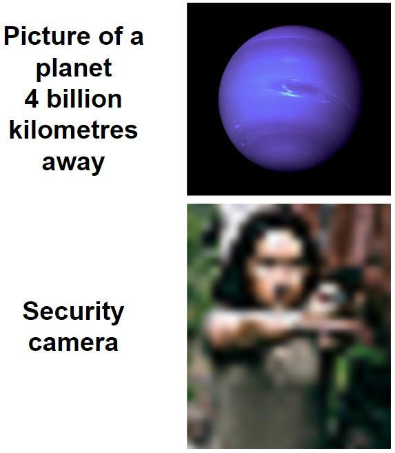
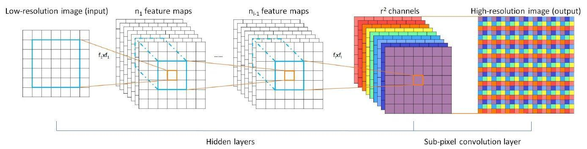
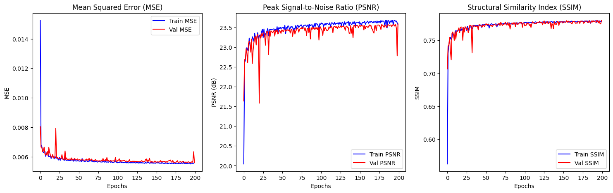
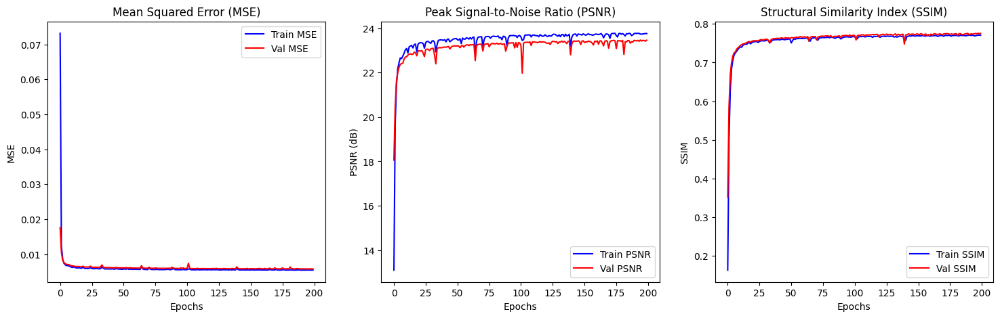

# Image Super-Resolution using Enhanced Sub-Pixel Convolutional Networks (ESPCN)

---

## 📜 Abstract

- **Problem Statement:** Super-resolution is crucial in enhancing image quality for applications like:
  - Medical imaging
  - Satellite photos
  - Security

- **Existing Methods:**
  - Traditional Interpolation: Bicubic, Bilinear – Fast but poor quality.
  - State-of-the-Art (e.g., Real-ESRGAN): High quality but computationally expensive.

- **Our Approach:**
  - We implement Efficient ESPCN, balancing performance and speed.
  - Compare results across different scaling factors (2x, 4x, 8x).
  - Compare with and without augmentation for scale=2.

---

## 1. 📌 Introduction

- **Existing Methods:**
  - Bicubic/Bilinear → Simple but low-quality
  - Real-ESRGAN / EDSR → High quality, high cost

- **ESPCN Motivation:**
  - Lightweight, real-time
  - PixelShuffle-based upsampling
  - Suitable for mobile, video, embedded, or web use-cases

---

## 2. 📂 Dataset – DIV2K (from Kaggle)

- Large, diverse collection of 2K resolution RGB images
- **Training set:** 800 HR images → LR pairs for ×2, ×4, ×8
- **Validation set:** 100 HR images
- **Test set:** 100 diverse images (HR released post-challenge)
- In this project: Only training HR images used to synthesize LR-HR pairs for SR model training.

---

## 3. 🔧 Proposed Methodology

### 🧪 Preprocessing & Augmentation

- Bicubic downsampling to create LR from HR
- Augmentations:
  - `HorizontalFlip(p=0.5)`
  - `RandomBrightnessContrast(p=0.3)`
  - `GaussNoise(var_limit=(5.0, 20.0), p=0.3)`
  - `ImageCompression(quality_lower=85, quality_upper=100, p=0.4)`
  - `RandomGamma(p=0.3)`
  - `HueSaturationValue(p=0.3)`

---

### 🧠 ESPCN Model Architecture

- Architecture:
  - `Input → Conv (ReLU) → Conv (ReLU) → Conv → Pixel Shuffle`
- Uses depth-to-space rearrangement for efficient upscaling
- Trained separately for scale=2, 4, 8
- Optimized using Adam
- Loss Function: Mean Squared Error (MSE)

---

## 4. 📏 Evaluation Metrics

### 🔹 PSNR (Peak Signal-to-Noise Ratio)

- Measures pixel-level fidelity using MSE.
- **Higher = Better** (≥ 30 dB is considered good)
- Limitations:
  - Doesn’t reflect human visual perception
  - Sensitive to pixel-level noise

---

### 🔸 SSIM (Structural Similarity Index Measure)

- Evaluates:
  - Luminance
  - Contrast
  - Structure
- **Range:** [-1, 1] → closer to 1 = more similar
- Better aligned with human perception than PSNR

---

## 5. 📊 Results and Comparison

### ▶️ Without Augmentation

---

### ▶️ With Augmentation
  

---

## ✅ Verdict

| Metric | Before Augmentation | After Augmentation | Verdict |
|--------|---------------------|--------------------|---------|
| **MSE** | Low, stable | Low, slightly smoother | Equal / Slightly better |
| **PSNR** | Slightly noisy, larger gap | Smoother, reduced gap | Improved generalization |
| **SSIM** | More variance, lower early on | Smoother, higher convergence | Improved structural quality |

---
